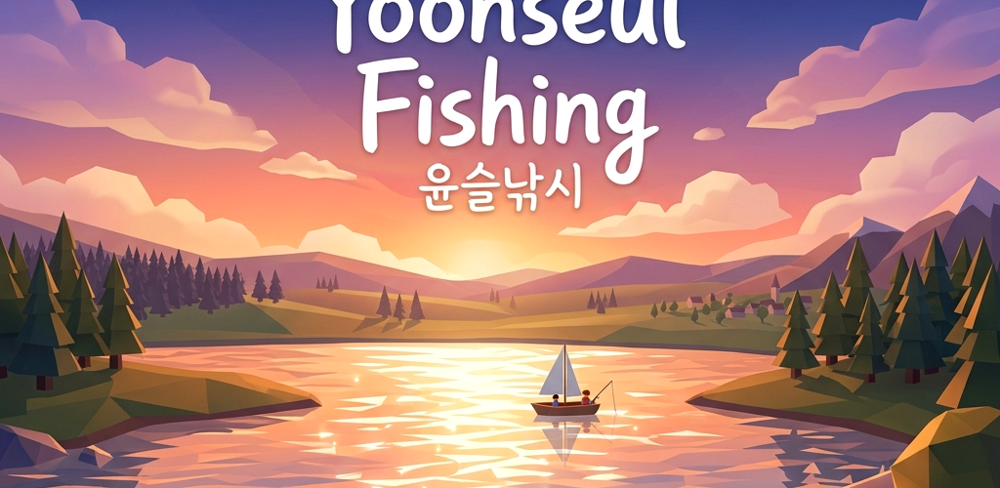

# 윤슬낚시 — Yoonseul Fishing

> **바쁜 일상 속에서 잔잔한 물결(윤슬)을 바라보며 지친 마음을 녹이는 힐링 낚시 게임**
>
> *A 2.5D low-poly healing fishing game designed to melt away your tired mind by watching calm water ripples (Yoonseul) and listening to procedurally generated soundscapes.*

---

<p align="center">
  
</p>

---

## 🌊 핵심 가치 & 브랜딩 (Core Values)

- **잔잔한 몰입감 (Atmospheric Calm)**: 햇빛과 달빛을 품고 물 위에 반짝이는 물결(윤슬)을 모티브로 삼아, 바라보는 것만으로 편안함을 선사하는 비주얼을 제공합니다.
- **절차적 음악 엔진 (Procedural Audio)**: 별도의 음원 파일 없이 Android `AudioTrack`을 통해 실시간으로 조율되는 펜타토닉 벨 연주, 바람 소리, 빗소리, 파도 소리를 합성합니다.
- **로컬 우선 정책 (Offline-First)**: 물고기를 낚고, 업그레이드를 하고, 도감을 완성하는 모든 진행 상태는 디바이스 내부 Room Database와 SharedPreferences에만 온전히 저장됩니다.

---

## ✨ 핵심 기능 (Key Features)

- **실시간 자연 합성 (Weather & Time Cycle)**: 낮, 노을, 밤에 이르는 부드러운 시간의 흐름과 맑음, 안개, 비 등 날씨 변화에 따라 음악의 구성과 그래픽 테마가 자동으로 교차 편집됩니다.
- **리드미컬 낚시 (Minimalist Rhythm Game)**: 찌가 완전히 가라앉는 순간 화면을 탭한 뒤, 좁혀지는 도넛 링의 타이밍에 맞춰 탭을 이어가는 직관적이면서도 깊이 있는 손맛을 제공합니다.
- **낚시터 및 미끼 상점 (Spots & Bait Shop)**: 레벨 제한이 있는 다양한 낚시터(바람의 계곡, 은하빛 호수, 파도소리 비치)를 여행하고, 특별한 확률 보정을 제공하는 미끼들을 코인으로 구매할 수 있습니다.
- **성장 및 업적 (Quests & Achievements)**: 일일 퀘스트와 다양한 업적 보상 체계, 그리고 낚아 올린 생명체들의 길이와 무게를 기록해 두는 도감 시스템이 준비되어 있습니다.

---

## 🛠️ 기술 스택 (Tech Stack)

| 영역 | 선택 기술 |
|---|---|
| **언어 (Language)** | Kotlin |
| **UI 프레임워크** | Jetpack Compose, Material 3 |
| **아키텍처 (Architecture)** | MVVM 아키텍처 |
| **로컬 데이터베이스** | Room Database |
| **사운드 합성 (Synthesis)** | Android AudioTrack (PCM 16Bit Mono, 22.05kHz) |
| **의존성 관리** | Gradle Kotlin DSL + 버전 카탈로그 (`libs.versions.toml`) |
| **어노테이션 프로세서** | Google Devtools KSP (Kotlin Symbolic Processing) |

---

## 📦 저장소 구조 (Project Structure)

```text
healing-fishing/
  app/
    src/main/
      java/com/jeiel85/healingfishing/
        data/         # Room Database, DAO, 엔티티 및 어종 메타데이터
          AppDatabase.kt
          CaughtFishDao.kt
          CaughtFishEntity.kt
          FishingRepository.kt
          FishSpecies.kt
        ui/
          theme/      # 디자인 시스템 테마 (Color, Type, Theme)
          AudioSynthesizer.kt  # 실시간 소리 합성 코어 (AudioTrack)
          FishingViewModel.kt  # 상태 및 퀘스트, 레벨 시스템 관리 비즈니스 로직
          HealingFishingGame.kt # 2.5D Canvas 렌더링 및 UI 전체 구성
      res/            # 다국어 리소스 (values-ko, values-en) 및 아이콘 벡터 리소스
  docs/               # 웹 랜딩 페이지 및 리소스 자산 (GitHub Pages 호스팅)
  gradle/             # Gradle wrapper 및 의존성 버전 설정 파일
```

---

## 🚀 빠른 시작 (Quick Start)

### 빌드 및 실행 요구조건

- **Android Studio**: Ladybug (2024.2.1) 이상 권장
- **JDK**: 17 이상
- **Android SDK**: Compile SDK 36 (targetSdk 36, minSdk 24)

### 로컬 실행 방법

1. **프로젝트 루트**에 `.env` 파일을 만들고 아래와 같이 작성합니다. (Secrets Plugin 구동용)
   ```env
   GEMINI_API_KEY=dummy_placeholder_key
   ```
2. **빌드 및 패키징 실행**:
   
   **Windows PowerShell**:
   ```powershell
   .\gradlew.bat test
   .\gradlew.bat assembleDebug
   ```

   **Linux / macOS**:
   ```bash
   chmod +x gradlew
   ./gradlew test
   ./gradlew assembleDebug
   ```
3. 생성된 APK를 에뮬레이터나 실기 디바이스에 배포하여 구동합니다.

---

## 📄 라이선스 (License)

본 프로젝트는 **MIT License** 하에 자유롭게 복제 및 배포가 가능합니다. 상세한 내용은 [LICENSE](LICENSE)가 적용됩니다.
